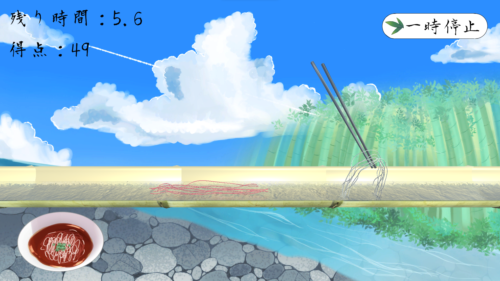
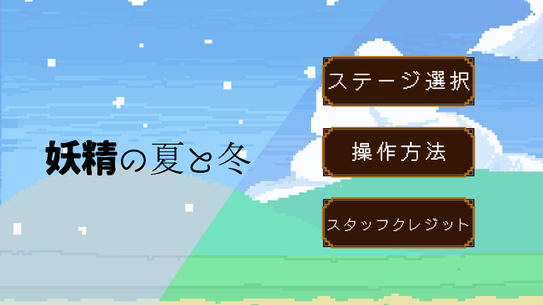
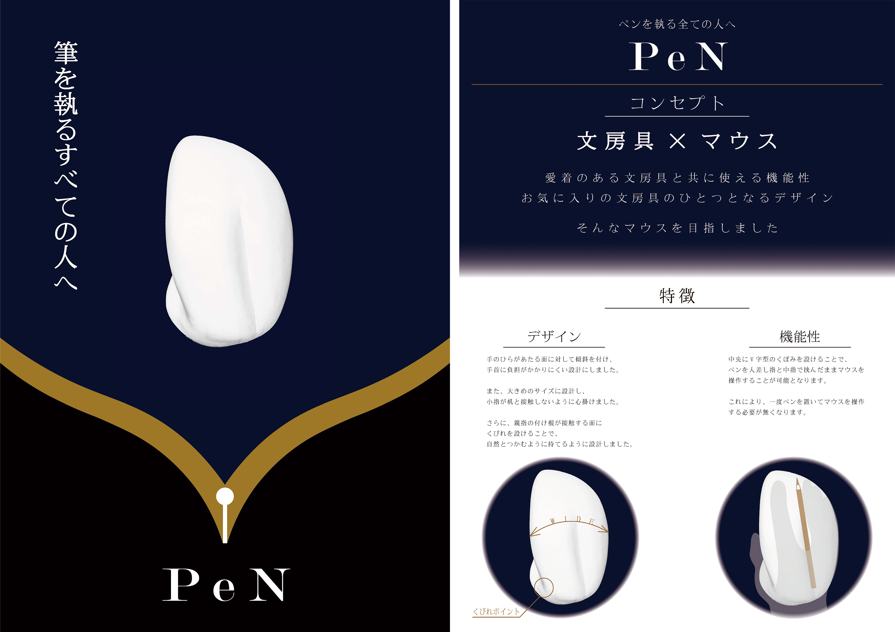
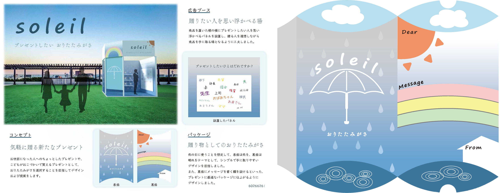
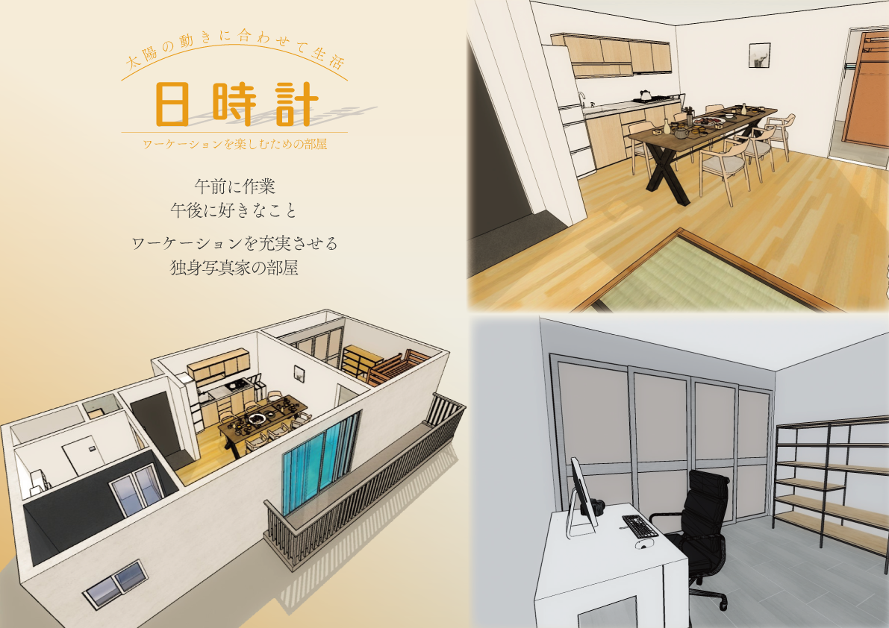
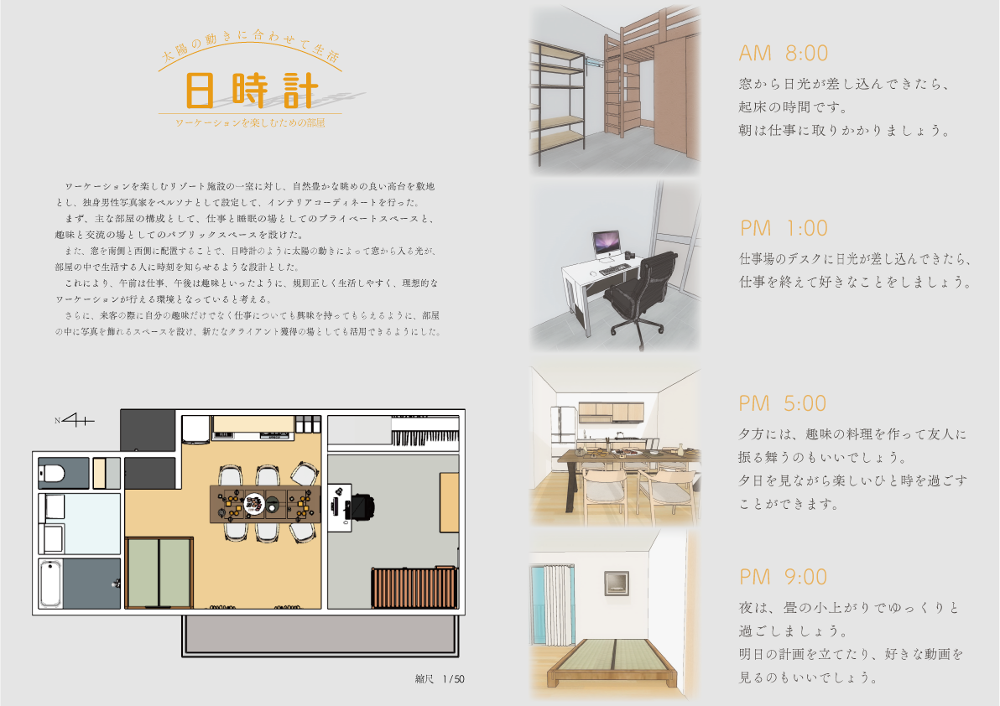
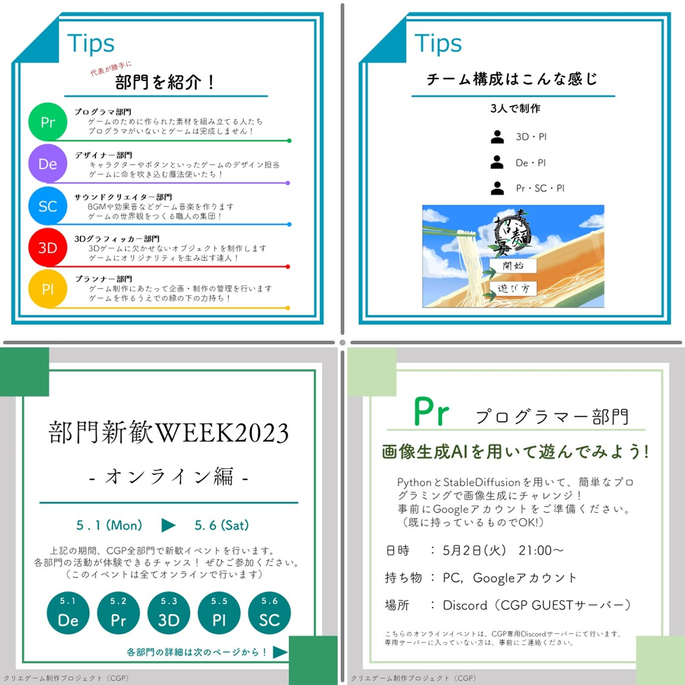
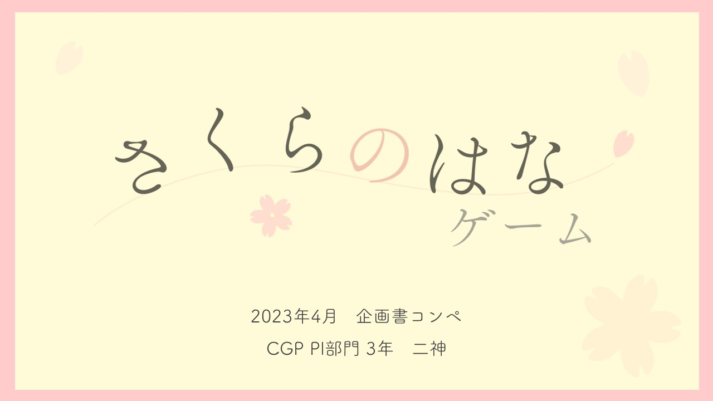
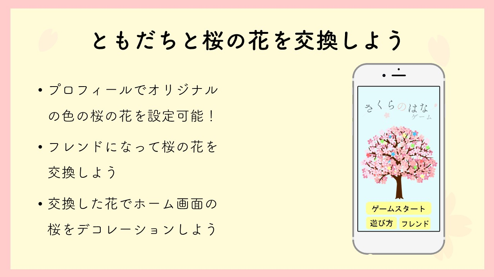

<h3>Hi there 👋</h3>

<h1>自己紹介</h1>

私は和歌山大学システム工学部在学で、情報工学やデザイン工学を主に学んでいます。また、学生プロジェクトでゲーム制作を行っています。学生プロジェクトでは、代表を務めています。

<li><a href="https://www.wakayama-u.ac.jp/sys/major/md/">和歌山大学システム工学部システム工学科
メディアデザインメジャー</a></li>
<li><a href="https://mdi-lab.sys.wakayama-u.ac.jp/">和歌山大学メディアインテリジェンス研究室</a></li>
<li>2025年卒業予定</li>
<li><a href="https://twitter.com/CGP_wakayama">和歌山大学クリエゲーム制作プロジェクト（CGP）</a>2023年度代表</li>

<h1>制作物</h1>
<h2> 目次</h2>
<a href="#game">ゲーム</a> 
<a href="#program">プログラム</a> 
<a href="#design">デザイン</a> 
<a href="#plan">企画</a> 
<a href="#cg">CG</a> 

<h2 id="game"> ゲーム</h2>

<h3>素麵招宴（流しそうめんシミュレータゲーム）</h3>
簡単な操作で、流しそうめんを体験できる、流しそうめん体験シミュレーションゲームです。 

   
  

<a href=https://unityroom.com/games/cgp-team2021-somen>プレイはこちらから</a> 

学生プロジェクトの活動にて、夏をテーマにした簡単な操作で遊べるゲームを制作しました。Unityroomへの投稿や大学祭などに出展した結果、老若男女多くの方に遊んでいただいただけではなく、YouTubeにてプレイ実況動画を投稿していただきました。 

担当：プログラム, サウンド制作, 企画 
使用した技術: Unity 
制作期間：6ヶ月 
制作時期：2022年夏〜冬（大学2年） 

<h3>妖精の夏と冬（アクションゲーム）</h3>
妖精の力を借りて妹を助けよう！　ステージの季節を切り替えて進む２Dアクションゲームです。 

   
  

<a href=https://unityroom.com/games/cgphackb_yousei>プレイはこちらから</a> 

学生プロジェクトの活動にて、季節を切り替えて先へ進む2Dアクションゲームを制作しました。 

担当：プログラム(タイトル・メニュー画面, BGMの実装), 企画 
使用した技術: Unity 
制作期間：3ヶ月 
制作時期：2022年冬〜2023年春（大学2年） 

<h2 id="program">プログラム</h2>

<h3>画像生成AIを用いて遊んでみよう!</h3>
Python（GoogleColaboratory）と画像生成AI（StableDiffusion）を用いて、気軽に画像生成ができることを紹介したサイトです。 

<a href=https://twogod23.github.io/CGP2023/pr2023/index.html>制作物はこちらから</a> 

学生プロジェクトの新歓イベント向けに、GoogleColabを用いて画像生成を行なって、プログラミングに興味を持ってもらうことを目的として企画・実施しました。プログラミング初心者でも簡単に楽しく実行できるように工夫しました。 

実施内容を「KC3 Meet! Vol.01」にて紹介させていただきました。 
<blockquote class="twitter-tweet" data-media-max-width="560">
ライトニングトーク始まりました！<a href="https://twitter.com/hashtag/KC3_Meet?src=hash&amp;ref_src=twsrc%5Etfw">#KC3_Meet</a> <a href="https://t.co/cRQtwmgOVu">pic.twitter.com/cRQtwmgOVu</a>
&mdash; KC3（関西情報系学生団体交流会） (@kc3_official) <a href="https://twitter.com/kc3_official/status/1713451352335237254?ref_src=twsrc%5Etfw">October 15, 2023</a></blockquote> 

担当：プログラム, 企画 
使用した技術: Python, StableDiffusion, HTML, CSS 
制作期間：約2週間 
制作時期：2023年春（大学3年） 

<h3>年代によるアイドルの楽曲の歌詞で使用される単語の違いの分析</h3>
アイドルの楽曲の歌詞で形態素解析を行い、歌詞の中に使用される単語の特徴を明らかにすることを目的として調査しました。 

<a href=https://github.com/twogod23/token_of_idolsong/blob/main/%E5%B9%B4%E4%BB%A3%E3%81%AB%E3%82%88%E3%82%8B%E3%82%A2%E3%82%A4%E3%83%88%E3%82%99%E3%83%AB%E3%81%AE%E6%A5%BD%E6%9B%B2%E3%81%AE%E6%AD%8C%E8%A9%9E%E3%81%A6%E3%82%99%E4%BD%BF%E7%94%A8%E3%81%95%E3%82%8C%E3%82%8B%E5%8D%98%E8%AA%9E%E3%81%AE%E9%81%95%E3%81%84%E3%81%AE%E5%88%86%E6%9E%90.pdf>調査結果のレポートはこちらから</a> 
<a href=https://github.com/twogod23/token_of_idolsong>使用したプログラムのリポジトリはこちらから</a> 

作詞された年代によって歌詞に使用される単語が異なるのではないかという疑問より、アイドルの歌詞を調査対象として、形態素解析を行い品詞ごとに分析して調査を行いました。結果は、時代によって歌詞の中で使用される単語は変化すると結論づけました。 

授業課題にて作成 
使用した技術: Python, BeautifulSoup（Webスクレイピング）, neologdn（テキストの正規化処理）, MeCab（形態素解析） 
制作期間：約2週間 
制作時期：2023年春（大学2年） 

<h3>食品廃棄を減らすことを助けるアプリの開発</h3>
「消費レベルにおける世界全体の一人当たりの食品の廃棄を半減させる」目標を達成するために、個人レベルでの食品廃棄を減らすことを助けるアプリです。KC3Hack2022にて、3人で1週間で完成させました。 

<a href=https://github.com/kc3hack/2022_c/tree/0346f>リポジトリはこちらから</a> 

私は、UIデザインと実装を行いました。
色覚異常の人でもボタンが判別しやすいように配色を工夫しました。 

<a href="https://kc3.me/hack/past-hack-event/">KC3Hack 2022にて作成</a> 
使用した技術: Unity, Windows標準ペイントソフト 
制作期間：約2週間 
制作時期：2022年春（大学1年） 

<h3>地域の観光地を発信するWebサイトの制作</h3>
地域の観光地を発信するWebサイトを制作する課題に対して、広島市と和歌山市を紹介するWebサイトを制作しました。 

  <a href="./Files/mysites_webdesign_a_hiroshima/mysights.html">広島市を紹介したWebサイトはこちらから</a> 
  <a href="./Files/mysites_webdesign_a/mysite.html">和歌山市を紹介したWebサイトはこちらから</a>

 

授業課題にて作成 
使用した技術: HTML, CSS 
制作期間：約1ヶ月 
制作時期：2022年春（大学2年） 

 

<h2 id="design"> デザイン</h2>

<h3>筆記具とともに使えるマウスのデザイン</h3>
新たなマウスのデザインとして、「文房具 ✕ マウス」をコンセプトに、ペンを置くことなく人差し指と中指の間に挟んだまま操作が行えるマウスを提案しました。 

  

 

新たなマウスのアイデアの考案、コンセプトを伝えるポスターの作成の授業課題に対して、パソコンと筆記用具を併用している人の行動を観察すると、筆記用具を一度置いてからマウス操作を行なっている点に着目して、筆記用具を置くことなく利用できるマウスを発案しました。
最終授業日に行われた受講者内投票では、2位に選ばれ、講義を担当する先生からも高い評価をいただきました。 

授業課題にて作成 
使用した技術: Illustrator, Photoshop 
制作期間：約2ヶ月 
制作時期：2022年夏（大学2年） 

 

<h3>折り畳み傘のパッケージデザイン</h3>
気軽に送れるプレゼントとして折り畳み傘に着目し、パッケージおよび広告ブースの企画・提案を行いました。 

  

 

パッケージデザインの考案、販促ブースの提案、それらの提案を伝えるプレゼンテーションシートを作成する授業課題に対して、気軽に送れるプレゼントとして折り畳み傘を題材として課題に取り組みました。 

授業課題にて作成 
使用した技術: Illustrator, Lightroom, Demension 
制作期間：約2ヶ月 
制作時期：2022年秋（大学2年） 

 

<h3>独身写真家をターゲットとしたインテリアデザインの提案</h3>
独身写真家をターゲットとして、ワーケーションができるアパートのインテリアデザインの提案を行いました。 

   
  

 

ワーケーションができるアパートのインテリアデザインの提案を行う授業課題に対して独身写真家をターゲットとして、午前中は仕事、午後は趣味に打ち込める住宅を目指し、生活リズムに合わせて日光が差し込むインテリア配置を行いました。
最終授業日に行われた受講者内投票では、5位に選ばれました。 

授業課題にて作成 
使用した技術: Illustrator, Lightroom, SketchUp 
制作期間：約1ヶ月 
制作時期：2023年夏（大学3年） 

 

<h3>学生プロジェクトのポスターのレイアウトデザイン</h3>
所属する学生プロジェクトのポスターのレイアウトデザインを行いました。 

  

 

学生プロジェクトの新たなポスターを制作するにあたり、親しみやすく見ていてワクワクするようなデザインと、活動内容が伝わりやすいデザインとなるように意識しました。特に親しみやすさを重視したデザインは、所属するメンバーに非常に好評です。 

担当：企画, レイアウトデザイン (素材画像は制作しておりません) 
使用した技術: Illustrator, Lightroom 
制作期間：1週間 
制作時期：2023年春（大学3年） 

<h3>学生プロジェクトの新歓イベント告知のSNS投稿の作成</h3>
所属する学生プロジェクトのポスターの新歓イベント告知を行うためのSNS投稿を作成しました。 

  

  <blockquote class="twitter-tweet" data-media-max-width="560">
【🏁​来週開催🏁​】 和歌山大学CGPです！ 来週4/17〜4/21は、『部門新歓WEEK2023-対面編-』として各部門で対面での新歓イベントを行います✨​ 各日18時〜の開催予定です！ 興味がある部門の活動を体験できるチャンス😊​ ご参加お待ちしています<a href="https://twitter.com/hashtag/%E6%98%A5%E3%81%8B%E3%82%89%E5%92%8C%E5%A4%A7?src=hash&amp;ref_src=twsrc%5Etfw">#春から和大</a> <a href="https://t.co/XfGjx9HwwA">pic.twitter.com/XfGjx9HwwA</a>
&mdash; 和歌山大学 クリエゲーム制作Project (CGP) (@CGP_wakayama) <a href="https://twitter.com/CGP_wakayama/status/1645325710557605888?ref_src=twsrc%5Etfw">April 10, 2023</a></blockquote> 

 

担当：デザイン 
使用した技術: PowerPoint 
制作期間：1日 
制作時期：2023年春（大学3年） 

<h2 id="plan">企画</h2>

<h3>快適なオフィス環境についての分析・考察</h3>

コロナウイルス収束によるオフィスでの勤務が増える現状に対して、快適なオフィス環境について考察することに意義があると考え、KJ法による議論を行なったうえで、ISM法とAHPにて分析を行いました。 

<a href="./Files/快適なオフィス環境についての分析・考察.pdf">PDFファイルはこちらから</a> 

授業課題にて作成 
制作期間：約2週間 
制作時期：2022年秋（大学2年） 

<h3>多くの人に視聴される映像コンテンツについての分析・考察</h3>

映像コンテンツを制作するにあたり、多くの人が見るコンテンツには特徴があるのではないかと考え、視聴率の高いテレビ番組を対象に、数量化理論第3類およびクラスター分析による分析・分類を行い、よく視聴される映像コンテンツの共通点について考察を行いました。 

<a href="./Files/多くの人に視聴される映像コンテンツについての分析・考察.pdf">PDFファイルはこちらから</a> 

授業課題にて作成 
制作期間：約2週間 
制作時期：2022年冬（大学2年） 

<h3>桜の花をつなげるパズルゲームの企画</h3>
学生プロジェクト内のゲーム企画コンペにて、桜の花をつなげるパズルゲームの企画書を作成しました。 

   
  

<a href="./Files/さくらのはなゲーム.pdf">企画書のPDFファイルはこちらから</a> 

 

桜の花をつなげて自らの木を成長させる、成長型パズルゲームです。友達とプレイしても楽しめる仕掛けも追加しました。 

<!--可能であればインスタの投稿-->
<blockquote class="twitter-tweet" data-media-max-width="560">
こんにちは！和歌山大学CGPです！ 活動内容の紹介です✨  4/28(金)に「企画書コンペ」を行いました🙌 全6人が&quot;春&quot;をテーマとしたオリジナルゲームの企画書を制作し、他メンバーによる厳正な審査の結果、3年生の二神が優勝しました🏆✨  6人が制作した企画書の一部がこちらです📖 <a href="https://t.co/lbegNsd8oX">pic.twitter.com/lbegNsd8oX</a>
&mdash; 和歌山大学 クリエゲーム制作Project (CGP) (@CGP_wakayama) <a href="https://twitter.com/CGP_wakayama/status/1654710070972932096?ref_src=twsrc%5Etfw">May 6, 2023</a></blockquote> 

制作期間：1週間 
制作時期：2023年春（大学3年） 

 

<h2 id="cg"> CG</h2>

<h3>缶ジュースのCM制作</h3>
缶ジュースの15秒CMを制作しました。 

  

授業内で清涼飲料水の15秒CMの制作の課題が出された際に制作しました。色々なものが詰まっているイメージで、明るい雰囲気になるようなCMを目指して制作しました。 

授業課題にて作成 
使用した技術: Blender, Illustrator, PremierePro 
制作期間：約2ヶ月 
制作時期：2022年冬（大学2年） 

 

<!--
**twogod23/twogod23** is a ✨ _special_ ✨ repository because its `README.md` (this file) appears on your GitHub profile.

Here are some ideas to get you started:

- 🔭 I’m currently working on ...
- 🌱 I’m currently learning ...
- 👯 I’m looking to collaborate on ...
- 🤔 I’m looking for help with ...
- 💬 Ask me about ...
- 📫 How to reach me: ...
- 😄 Pronouns: ...
- ⚡ Fun fact: ...
-->
